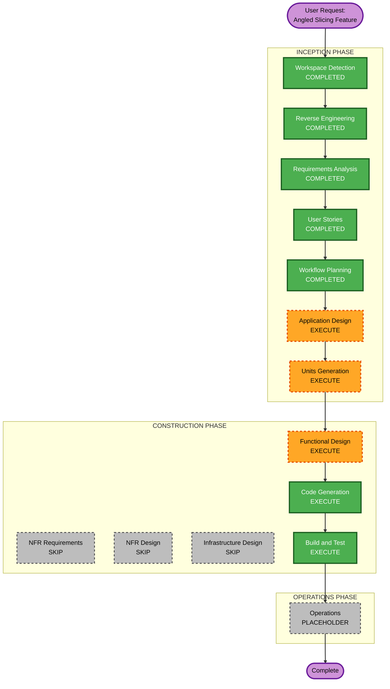

# Execution Plan — Angled Slicing Feature

## Detailed Analysis Summary

### Transformation Scope
- **Transformation Type**: New feature integrated into existing pipeline
- **Primary Changes**: Slicing plane orientation (posSlice), new config parameters, preview adaptation
- **Related Components**: TriangleMeshSlicer, PrintObject::slice(), PrintConfig, Layer, GCode preview rendering

### Change Impact Assessment
- **User-facing changes**: Yes — new Print Settings section, preview shows tilted layers
- **Structural changes**: Yes — new slicing geometry computation, new pipeline behavior at posSlice
- **Data model changes**: Yes — new config options (angle, direction), Layer may need additional metadata
- **API changes**: No — G-code output format unchanged, no new APIs
- **NFR impact**: Yes — performance (more layers at steep angles), geometry accuracy

### Component Relationships
```
PrintConfig (new params) ←── PrintObject::slice() (angled plane computation)
                                    │
                                    ├── TriangleMeshSlicer (intersection with tilted planes)
                                    ├── Layer (stores tilted slice results)
                                    │     ├── PerimeterGenerator (operates normally on 2D slices)
                                    │     ├── Fill/* (operates normally on 2D regions)
                                    │     └── Support/* (overhang angle relative to tilt)
                                    │
                                    └── GCode/Preview (layer visualization with tilt metadata)
```

### Risk Assessment
- **Risk Level**: Medium-High (fundamentally changes slicing geometry; affects all downstream)
- **Rollback Complexity**: Easy (config-gated, angle=0 is identity)
- **Testing Complexity**: Moderate (geometric correctness + visual validation)

---

## Workflow Visualization



---

## Phases to Execute

### INCEPTION PHASE
- [x] Workspace Detection (COMPLETED)
- [x] Reverse Engineering (COMPLETED)
- [x] Requirements Analysis (COMPLETED)
- [x] User Stories (COMPLETED)
- [x] Workflow Planning (COMPLETED)
- [ ] Application Design — **EXECUTE**
  - **Rationale**: New algorithm needs component design. Must define: angled plane computation module, its interface to TriangleMeshSlicer, how Layer stores tilt metadata, config parameter definitions, and preview rendering adaptation. Multiple new components needed.
- [ ] Units Generation — **EXECUTE**
  - **Rationale**: Feature decomposes into multiple units: (1) Config/parameters, (2) Core angled slicing algorithm, (3) Preview adaptation, (4) First-layer handling. Each unit has distinct dependencies and can be developed incrementally.

### CONSTRUCTION PHASE (per-unit loop)
- [ ] Functional Design — **EXECUTE**
  - **Rationale**: Complex geometric algorithm needs detailed design before coding. Must specify: tilted plane equation, mesh intersection approach, Z-clipping logic, layer height distribution, and first-layer detection. PBT properties must be identified here.
- [ ] NFR Requirements — **SKIP**
  - **Rationale**: User opted out of resiliency baseline. Performance is tracked as a requirement but doesn't need a separate NFR stage. The 2x performance budget is already in requirements.md.
- [ ] NFR Design — **SKIP**
  - **Rationale**: NFR Requirements skipped → NFR Design skipped.
- [ ] Infrastructure Design — **SKIP**
  - **Rationale**: Desktop C++ application. No cloud infrastructure, no deployment model changes. Build system changes are trivial (add new source files to CMakeLists.txt).
- [ ] Code Generation — **EXECUTE** (ALWAYS)
  - **Rationale**: Implementation of all designed components.
- [ ] Build and Test — **EXECUTE** (ALWAYS)
  - **Rationale**: Compile, run unit tests, validate G-code output.

### OPERATIONS PHASE
- [ ] Operations — **PLACEHOLDER** (future)

---

## Unit Decomposition (Preview)

Based on the requirements and stories, the feature will be decomposed into these units during Units Generation:

| Unit | Description | MVP | Dependencies |
|------|-------------|-----|--------------|
| **Unit 1: Config & Parameters** | New PrintConfig options (angle, direction), serialization, UI binding | Yes | None |
| **Unit 2: Angled Slice Engine** | Tilted plane computation, mesh intersection, Z-clipping, multi-first-layer detection | Yes | Unit 1 |
| **Unit 3: Preview Adaptation** | Layer visualization with tilt, layer slider behavior | Yes | Unit 2 |
| **Unit 4: Support Compatibility** | Overhang detection relative to tilted planes, brim at Z=0 | Post-MVP | Unit 2 |

---

## Estimated Timeline (Active Development Time)

| Stage | Estimate |
|-------|----------|
| Application Design | 1 session |
| Units Generation | 1 session |
| Functional Design (per unit) | 1 session per unit |
| Code Generation (per unit) | 2-4 sessions per unit |
| Build and Test | 1-2 sessions |
| **Total** | **~12-18 sessions** |

---

## Success Criteria

- **Primary Goal**: Slice a Benchy at a non-zero angle and produce valid G-code with visibly tilted layer lines
- **Key Deliverables**: Working angled slicing engine, config UI, basic preview, exportable G-code
- **Quality Gates**:
  - All existing PrusaSlicer unit tests pass
  - Angle=0 produces bit-for-bit identical output
  - PBT tests pass for geometric transformation functions
  - G-code loads in a viewer without errors
